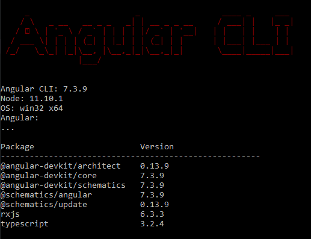

# Angular-CLI
---

## 安装
```
npm i @angular/cli -g
```

## 检查版本(查看是否安装成功)
```
ng v
```



## 常用命令

命令 | 别名 | 作用
-- | :--: | --
add  | | 为项目引用外部包
analytics  |   |  配置Angular CLI使用指标的收集
[build](#build)  | b | 打包项目到dist文件夹下
config  |   | 在工作空间中的angular.json检索或者设置Angular配置
doc | d | 根据关键字搜索官方文档
e2e | e | 打包并启动Angular程序,然后使用Protractor端到端测试
[generate](#generate) | g | 根据[标识](#schematic-list)构建并且/或者更改文件
help | | 列出所有可用命令及它们的简短描述
lint | l | 运行代码规范工具
[new](#new) | n | 创建一个新的workspace并且初始化Angular程序
serve | s | 构建并启动程序(热重载)
test | t | 运行单元测试
update | | 更新你的应用依赖
version| v | 输出Angular CLI版本
xi18n| | 从源码中提取国际化信息

## build
```
ng build <project> [options]
or
ng b <project> [options]
```
##### options


## generate 可接受参数
```
ng generate <schematic> [options]
or
ng g <schematic> [options]
```
##### schematic list
+ appShell
+ application
+ class
+ component
+ directive
+ enum
+ guard
+ interface
+ library
+ module
+ pipe
+ service
+ serviceWorker
+ universal
+ webWorker
