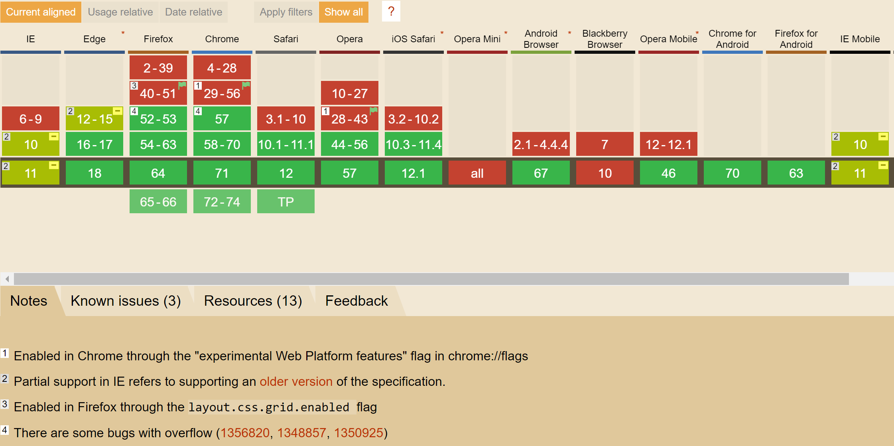
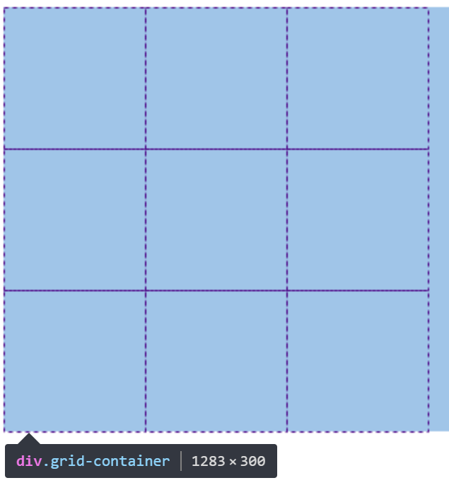

# 网格布局(Grid layout)

> CSS网格布局用于将页面分割成数个主要区域，或者用来定义组件内部元素间大小、位置和图层之间的关系。
像表格一样，网格布局让我们能够按行或列来对齐元素。 但是，使用CSS网格可能还是比CSS表格更容易布局。 例如，网格容器的子元素可以自己定位，以便它们像CSS定位的元素一样，真正的有重叠和层次。相对于flex布局(一维布局)来讲**Grid布局是二维的**。

**兼容性列表**



## 开始使用

* 创建网格布局容器
```
<div class="grid-container"></div>
```
```
.grid-container {
  display: grid; // 块级网格容器, display: inline-grid; 内联网格容器
}
```
* 分配网格空间
```
// repeat(3, 100px)  --> 100px 100px 100px
.grid-container {
  display: grid;
  grid-template-rows: repeat(3, 100px); // 将容器分为3行, 每行高100px。
  grid-template-columns: repeat(3, 100px); // 将容器分为3列, 每列宽100px;
}
```

