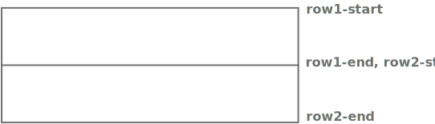
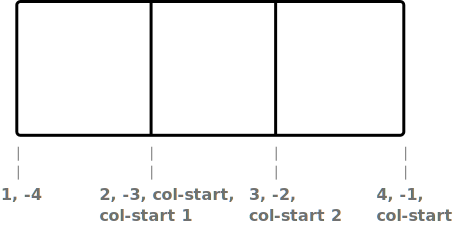
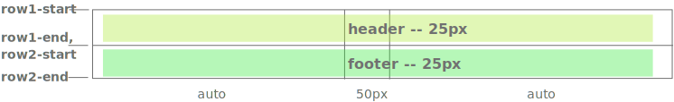
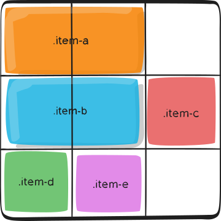
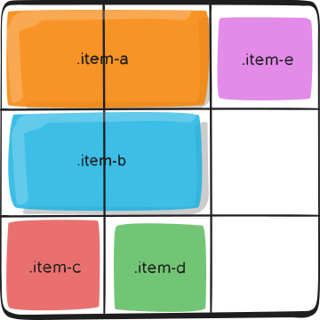
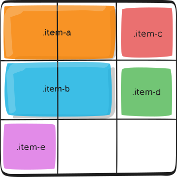

# 网格布局(Grid layout)

> CSS网格布局用于将页面分割成数个主要区域，或者用来定义组件内部元素间大小、位置和图层之间的关系。
像表格一样，网格布局让我们能够按行或列来对齐元素。 但是，使用CSS网格可能还是比CSS表格更容易布局。 例如，网格容器的子元素可以自己定位，以便它们像CSS定位的元素一样，真正的有重叠和层次。相对于flex布局(一维布局)来讲**Grid布局是二维的**，本文以从左到右书写方式进行说明与举例。

**兼容性列表**


## 示例

* **创建网格布局容器**
```html
<div class="grid-container"></div>
```
```
.grid-container {
  display: grid; // 块级网格容器, display: inline-grid; 内联网格容器
}
```
* **分配网格空间**
```css
// repeat(3, 100px)  --> 100px 100px 100px
.grid-container {
  display: grid;
  grid-template-rows: repeat(3, 100px); // 将容器分为3行, 每行高100px。
  grid-template-columns: repeat(3, 100px); // 将容器分为3列, 每列宽100px;
}
```


## 一、**容器**属性说明
1. ### **grid-template-rows/grid-template-columns**
    该属性用于定义网格线名称以及网格轨道大小(也就是直译过来的意思, 网格行/列模板)
    ```
    grid-template-columns: <track-size> ... | <line-name> <track-size> ...
    grid-template-rows: <track-size> ... | <line-name> <track-size> ...
    ```
    * **\<track-size\>**: 可以是长度、百分比或者等份网格容器中可用空间（使用 `fr` 单位）
    * **\<line-name\>**: 网格线名称，自己任意起名字

    例如：
    a. **如果你不显式地规定网格线名称，它们会按照文档写入顺序隐式地赋值**
    ```css
      container {
        grid-template-columns: 40px 50px auto 50px 40px;
        grid-template-rows: 25% 100px auto;
      }
    ```
    
    b. **规定了网格线名称**
    ```css
    .container {
      grid-template-columns: [first] 40px [line2] 50px [line3] auto [col4-start] 50px [five] 40px [end];
      grid-template-rows: [row1-start] 25% [row1-end] 100px [third-line] auto [last-line];
    }
    ```
    

    c.  **一条网格线可以有多个名称**
    ```css
    .container {
      grid-template-rows: [row1-start] 25% [row1-end row2-start] 25% [row2-end];
    }
    ```
    

    d.  **如果你定义的网格线名称包含多个重复值, 可以使用`repeat()`来简化定义, 同时，如果多条网格线名称相同, 可以按照定义顺序来找到对应的网格线**
    ```css
    .container {
      grid-template-columns: repeat(3, 20px [col-start]);
    }
    // 上面代码等同于
    .container {
      grid-template-columns: 20px [col-start] 20px [col-start] 20px [col-start];
    }
    ```
    

2. ### **grid-template-areas**
    通过引用 grid-area 属性指定的网格区域(Grid Area)的名称来定义网格模板。重复网格区域的名称来使内容跨越这些单元格。一个点号（.）代表一个空单元格。这个语法可视作网格布局的可视化结构。
    ```css
    .container {
      grid-template-areas:
        "<grid-area-name> | . | none | ..."
        "...";
    }
    ```
    例如:
    ```css
    .item-a {
      grid-area: header;
    }
    .item-b {
      grid-area: main;
    }
    .item-c {
      grid-area: sidebar;
    }
    .item-d {
      grid-area: footer;
    }

    .container {
      grid-template-columns: 50px 50px 50px 50px;
      grid-template-rows: auto;
      grid-template-areas:
        "header header header header"
        "main main . sidebar"
        "footer footer footer footer";
    }
    ```
    
    你所声明的每一行都需要有相同数量的单元格

    你可以使用任意数量的点(.)来表明一个空单元格，但是这些点(.)之间不可以有空格

    注意，你不能使用这个表达式来命名网格线，该表达式只适用于网格区域。当你使用这个表达式来命名网格区域的时候，网格线已经被自动命名。 就像该例子中的header区域，那么这个区域**上面**和**左面**的网格线就是`header-start`，对应的**下面**和**右面**的网格线就是`header-end`

3. ### **grid-template**
   是`grid-template-rows`, `grid-template-columns`和`grid-template-areas`的合并简写形式
   ```css
    .container {
      grid-template: none | <grid-template-rows> / <grid-template-columns>;
    }
   ```
   + **none**: 设置这三个属性的初始值
   + **\<grid-template-rows\> / \<grid-template-columns\>**: 分别设置网格行和列的值，同时设置`grid-template-areas` 为 `none`

    它还接受一种更复杂但非常方便的语法来指定这三种方法。如下例:
    ```css
    .container {
      grid-template:
        [row1-start] "header header header" 25px [row1-end]
        [row2-start] "footer footer footer" 25px [row2-end]
        / auto 50px auto;
    }
    // 等同于
    .container {
      grid-template-rows: [row1-start] 25px [row1-end row2-start] 25px [row2-end];
      grid-template-columns: auto 50px auto;
      grid-template-areas:
        "header header header"
        "footer footer footer";
    }
    ```
    

    **注意: `grid-template`不会重置网格隐式属性(`grid-auto-columns`, `grid-auto-rows`, `grid-auto-flow`), 推荐使用`grid`属性来代替`grid-template`**

3. ### **grid-column-gap/grid-row-gap**
    用于指定网格线的宽度(也就是行列之间的间距)
    ```css
    .container {
      grid-column-gap: <line-size>;
      grid-row-gap: <line-size>;
    }
    ```
    例:
    ```css
    .container {
      grid-template-columns: 100px 50px 100px;
      grid-template-rows: 80px auto 80px;
      grid-column-gap: 10px;
      grid-row-gap: 15px;
    }
    ```
    

4. ### **grid-gap**
    是`grid-row-gap`和`grid-column-gap`的合并简写形式
    ```css
    .container {
      grid-gap: <grid-row-gap> <grid-column-gap>;
    }
    ```
    如果`<grid-row-gap>`没有指定，那么`<grid-row-gap>`的值将与`<grid-column-gap>`的值相同

5. ### **justify-items/align-items**
    justify-items: 沿着inline(行)轴对齐网格元素
    align-items: 与justify-items相反, 沿着block(列)轴对齐网格元素
    属性适用于容器内所有的网格元素

    ```css
    .container {
      justify-items: start | end | center | stretch;
    }
    ```
    + **start**: 左侧对齐， 将网格项对齐到单元格水平方向起始边缘。
    + **end**: 右侧对齐，将网格项对齐到单元格水平方向结束边缘。
    + **center**: 居中对齐，将网格项对齐到单元格水平方向中间位置。
    + **stretch**: 填充(默认)， 将网格项填满单元格宽度
    下方分别为start, end, center和stretch的效果。
    
    
    
    

    ```css
    .container {
      align-items: start | end | center | stretch;
    }
    ```
    + **start**: 顶部对齐， 将网格项对齐到单元格垂直方向起始边缘。  
    + **end**: 底部对齐，将网格项对齐到单元格垂直方向结束边缘。  
    + **center**: 居中对齐，将网格项对齐到单元格垂直方向中间位置。
    + **stretch**: 填充(默认)， 将网格项填满单元格高度
    下方分别为start, end, center和stretch的效果。
    
    
    
    

    你也可以通过设置网格项的`align-self`属性来控制每一个网格项的对齐方式

6. ### **place-items**
    是`align-items`和`justify-items`的合并简写形式
    ```css
    .container {
      place-items: <align-items> <justify-items>
    }
    ```
    如果该属性中`align-items`没有指定，将会于`justify-items`值相同

7. ### **justify-content/align-content**
    当网格项的总大小小于容器大小时候网格项的水平/垂直对齐方式。
    ```css
      .container {
        justify-content: start | end | center | stretch | space-around | space-between | space-evenly;
      }
    ```
    + **start**: 左侧对齐，将网格项对齐到容器水平方向起始边缘。  
      
    + **end**: 右侧对齐，将网格项对齐到容器水平方向结束边缘。  
      
    + **center**: 居中对齐，将网格项对齐到容器水平方向中间位置。  
      
    + **stretch**: 填充，将网格项填满容器宽度  
      
    + **space-around**: 每个网格项之间设置相同的间距，两端设置一半间距  
      
    + **space-between**: 每个网格项之间设置相同的间距，两端不设置间距  
      
    + **space-evenly**: 每个网格项之间设置相同的间距，两端设置与网格间同样的间距  
      

    ```css
    .container {
      align-content: start | end | center | stretch | space-around | space-between | space-evenly;
    }
    ```
    + **start**: 顶部对齐，将网格项对齐到容器垂直方向起始边缘。  
        
    + **end**: 底部对齐，将网格项对齐到容器垂直方向结束边缘。  
        
    + **center**: 居中对齐，将网格项对齐到容器垂直方向中间位置。  
      
    + **stretch**: 填充，将网格项填满容器高度  
      
    + **space-around**: 每个网格项之间设置相同的间距，两端设置一半间距  
      
    + **space-between**: 每个网格项之间设置相同的间距，两端不设置间距  
      
    + **space-evenly**: 每个网格项之间设置相同的间距，两端设置与网格间同样的间距  
      

8. ### **place-content**
    是`align-content`与`justify-content`的合并简写形式
    ```css
    .container {
      place-content: <align-content> <justify-content>
    }
    ```
    如果该属性的`align-content`没有指定，其值将会于`justify-content`相同

9. ### **grid-auto-columns/grid-auto-rows**
    指定**超出容器指定行/列**的行/列大小。当网格项个数超出容器指定行和列切割后的单元格个数时，容器会自动给超出的网格项创建一个隐式网格轨道(行/列)
    ```css
    .container {
      grid-auto-columns: <track-size> ...;
      grid-auto-rows: <track-size> ...;
    }
    ```
    例:
    ```css
    .container {
      grid-template-columns: 60px 60px;
      grid-template-rows: 90px 90px
    }
    .item-a {
      grid-column: 1 / 2;   // 从第1条列网格线到第2条列网格线
      grid-row: 2 / 3;      // 从第2条行网格线到第3条行网格线
    }
    .item-b {
      grid-column: 5 / 6;   // 从第5条列网格线到第6条列网格线
      grid-row: 2 / 3;      // 从第2条行网格线到第3条行网格线
    }
    ```
    

    因为item-b不在我们规定的容器网格内，所以容器创建了隐式的网格来放置该网格项，然后我们设置`grid-auto-columns`为60px
    ```css
    .container {
      grid-auto-columns: 60px;
    }
    ```
    
10. ### **grid-auto-flow**
    如果你有一些没有明确表明在网格上放置位置的网格项，自动放置算法(auto-placement algorithm)会帮你自动放置这些网格项，该属性用于控制自动放置算法的规则。
    ```css
    .container {
      grid-auto-flow: row | column | row dense | column dense
    }
    ```
    + **row**: 告诉自动放置算法去依次填充每一行，根据需要添加新行(默认)。
    + **column**: 告诉自动放置算法去依次填充每一列，根据需要添加新列
    + **dense**: 告诉自动放置算法在出现较小的网格项的时候，尝试用它去填充之前的空缺.(该属性可能会改变你的网格项的顺序，可能会对可访问性产生不利影响)

    例:
    + **row**
    ```html
    <section class="container">
      <div class="item-a">item-a</div>
      <div class="item-b">item-b</div>
      <div class="item-c">item-c</div>
      <div class="item-d">item-d</div>
      <div class="item-e">item-e</div>
    </section>
    ```
    ```css
    .container {
        display: grid;
        grid-template-columns: 60px 60px 60px;
        grid-template-rows: 60px 60px 60px;
        grid-auto-flow: row;
      }
      .item-a,
      .item-b {
        grid-column: 1 / 3;
      }
    ```
    

    + **column**
    ```css
    .container {
      grid-auto-flow: column;
    }
    ```
    

    + **dense row**
    ```css
    .container {
      grid-auto-flow: dense row;
    }
    ```
    

    + **dense column**
    ```css
    .container {
      grid-auto-flow: dense column;
    }
    ```
    

11. ### **grid**
    为`grid-template-rows`, `grid-template-columns`, `grid-template-areas`, `grid-auto-rows`, `grid-auto-columns`, 和 `grid-auto-flow`的合并简写形式, 其余的次级属性被重置为初始值。
    ```css
    .container {
      grid: <'grid-template'> | <'grid-template-rows'> / [ auto-flow && dense? ] <'grid-auto-columns'>? | [ auto-flow && dense? ] <'grid-auto-rows'>? / <'grid-template-columns'>
    }
    ```
    + **grid-template**
    定义了 grid-template，其包含 grid-template-columns，grid-template-rows 和 grid-template-areas。
    + **<'grid-template-rows'> / [ auto-flow && dense? ] <'grid-auto-columns'>?**
    通过 grid-template-rows 属性显式设置网格容器行数(同时grid-template-columns 属性设为 none)，并通过设置 grid-auto-columns 来控制自动列的宽度（同时grid-auto-rows属性设为 auto。当auto-flow在(/)号右侧的时候，grid-auto-flow 属性也被相应的设置为 column，如果有 dense参数则 grid-auto-flow属性被设置为 dense column。
    + **[ auto-flow && dense? ] <'grid-auto-rows'>? / <'grid-template-columns'>**
    通过 grid-template-columns 属性显式设置网格容器列数（同时grid-template-rows 属性设为 none），并通过设置 grid-auto-rows 来控制自动行的高度（同时grid-auto-columns属性设为 auto）。当auto-flow在(/)号左侧的时候，grid-auto-flow 属性也被相应的设置为 row，如果有 dense参数则 grid-auto-flow属性被设置为 dense row。
    例:
    ```css
    .container {
      display: grid;
      grid: 100px 300px / 3fr 1fr;
    }
    /*等同于*/
    .container {
      display: grid;
      grid-template-rows: 100px 300px;
      grid-template-columns: 3fr 1fr;
    }
    /*---------------------------------------------*/
    .container {
      grid: auto-flow / 200px 1fr;
    }
    /*等同于*/
    .container {
      grid-auto-flow: row;
      grid-template-columns: 200px 1fr;
    }
    /*---------------------------------------------*/
    .container {
      grid: 100px 300px / auto-flow 200px;
    }
    /*等同于*/
    .container {
      grid-auto-flow: column;
      grid-template-rows: 100px 300px;
      grid-auto-columns: 200px;
    }
    ```

## 二、**网格项(Grid items)**属性说明  
>注意： 网格项的float, display:inline-block/table-cell, vertical-align和column-\*属性将会失效。

1. ### **grid-column-start/grid-column-end/grid-row-start/grid-row-end**
    通过引用特定的网格线(grid line)来确定网格项在网格容器中的位置。
    ```css
      .item {
        grid-column-start: <number> | <name> | span <number> | span <name> | auto
        grid-column-end: <number> | <name> | span <number> | span <name> | auto
        grid-row-start: <number> | <name> | span <number> | span <name> | auto
        grid-row-end: <number> | <name> | span <number> | span <name> | auto
      }
    ```
    + **\<number\> / \<name\>**: 可以是网格线编号或者已命名的网格线的名字
    + **span \<number\>**: 该网格项跨越的轨道数量
    + **span \<name\>**: 该网格项跨越到网格线的名称
    + **auto**: 自动放置
    注意: 如果没有设置`grid-column-end/grid-row-end` ，那么网格项将默认跨越一个轨道  
    例:
    ```css
    .item-a {
      grid-column-start: 2;
      grid-column-end: five;
      grid-row-start: row1-start;
      grid-row-end: 3;
    }
    ```
    
    ```css
    .item-b {
      grid-column-start: 1;
      grid-column-end: span col4-start;
      grid-row-start: 2;
      grid-row-end: span 2;
    }
    ```
    

2. ### **grid-column/grid-row**
    是 `grid-column-start` + `grid-column-end`,和 `grid-row-start` + `grid-row-end`的合并简写形式
    ```css
    .item {
      grid-column: <start-line> / <end-line> | <start-line> / span <value>;
      grid-row: <start-line> / <end-line> | <start-line> / span <value>;
    }
    ```
    例:
    ```css
    .item-c {
      grid-column: 3 / span 2;
      grid-row: third-line / 4;
    }
    ```
    

3. ### **grid-area**
    设置网格项名称，便于网格模板创建(grid-template-areas)的时候引用。另外，这个属性还是`grid-row-start` + `grid-column-start` + `grid-row-end` + `grid-column-end`的合并简写形式。  
    ```css
    .item {
      grid-area: <name> | <row-start> / <column-start> / <row-end> / <column-end>;
    }
    ```
    例:   
    + 给item-d起名为 header  
    ```css
    .item-d {
      grid-area: header
    }
    ```
    + 合并简写形式
    ```css
    .item-d {
      grid-area: 1 / col4-start / last-line / 6
    }
    ```
    

4. ### **justify-self/align-self**
    设置网格项自己在单元格内的水平/垂直对齐方式
    ```css
    .item {
      justify-self: start | end | center | stretch(默认);
    }
    ```
    
    
    
    

    ```css
    .item {
      align-self: start | end | center | stretch(默认);
    }
    ```
    
    
    
    

5. ### **place-self**
    是`justify-self` 和 `align-self`的合并简写形式
    ```css
    .item-a {
      place-self: center;
    }
    /*相当于*/
    .item-a {
      justify-self: center;
      align-self: center;
    }
    ```
    

    参考文档:
    1. https://css-tricks.com/snippets/css/complete-guide-grid/
    2. https://developer.mozilla.org/zh-CN/docs/Web/CSS/grid
